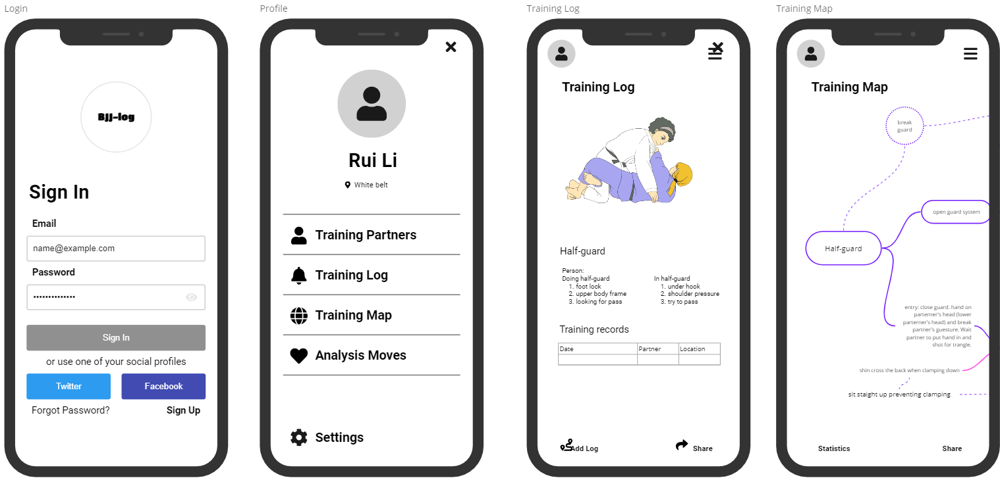

### BJJ-Log
 

## Introduction and problem statement:

Within the realm of BJJ, a profound challenge persists for practitioners: the tendency to forget acquired techniques, moves, and strategies over time and the lack of tools to track and record learned moves. This impediment not only hampers progress but also undermines the overall efficacy and satisfaction derived from training. To address this pressing issue, we present BJJ-Log—an innovative phone and tablet application (Figure 1) poised to revolutionize the landscape of BJJ instruction, facilitating enhanced learning, comprehensive training organization, and dynamic community engagement.
